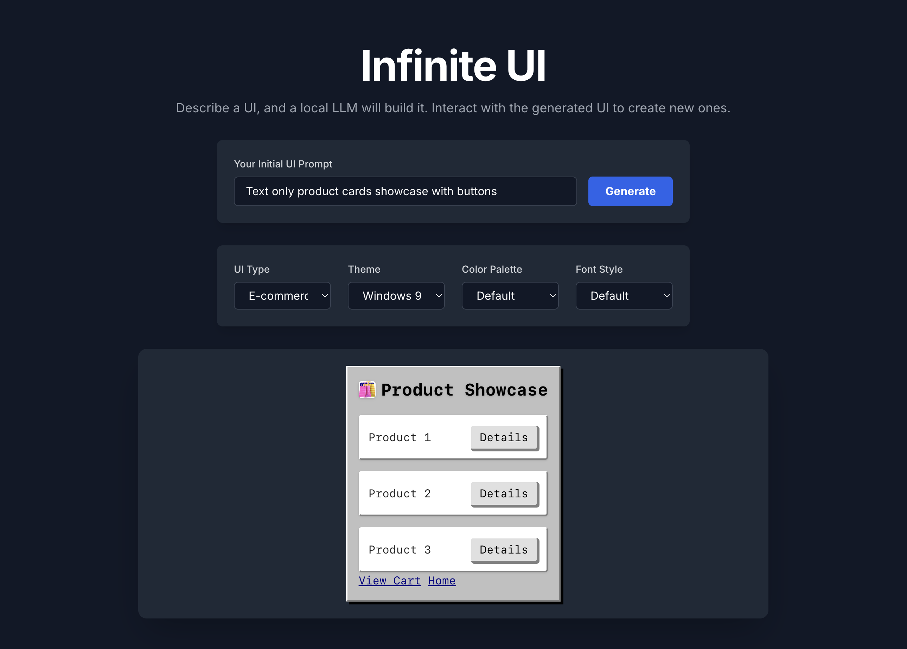

# Infinite UI

 
> What if each click generated a brand new screen for that user instead of displaying an existing page?

Original concept and code by James R.

  ---

**Table of Contents**

1.  [Introduction ↗](#introduction)
2.  [How It Works ↗](#how-it-works)
3.  [Requirements ↗](#requirements)
4.  [Setup Instructions ↗](#setup)
5.  [Using Infinite UI ↗](#usage)
6.  [Troubleshooting ↗](#troubleshooting)
7.  [More Information ↗](#info)

  

## **1. Introduction** 

  

**Infinite UI** is an interactive web playground for generating new user interfaces with the help of a local Large Language Model (LLM). Describe any UI you want, select a style, and Infinite UI will build it for you—right in your browser. Click on elements in the generated UI to create new screens... an Infinitely Generated UI.

  

This project is designed to be simple to set up and use, requiring only a modern browser and a local LLM running via [LM Studio ↗](https://lmstudio.ai/).

  

## **2. How It Works** 

  

Infinite UI sends your UI description and customization options to a local LLM (such as Qwen2.5-Coder-14B-Instruct) running in LM Studio. The LLM responds with raw HTML styled with Tailwind CSS, which is then rendered live in your browser. Interactive elements (like buttons) can trigger the generation of new UIs, allowing you to explore endless UI flows without writing any code.

  

## **3. Requirements** 

-   [LM Studio ↗](https://lmstudio.ai/) installed on your computer
-   A compatible LLM (tested with [Qwen2.5-Coder-14B-Instruct-GGUF ↗](https://huggingface.co/Qwen/Qwen2.5-Coder-14B-Instruct-GGUF))
-   Modern web browser (Chrome, Edge, Firefox, etc.)
-   No backend or external dependencies required

  

## **4. Setup Instructions** 

1.  **Download and Install LM Studio**

-   Go to [lmstudio.ai ↗](https://lmstudio.ai/) and install the app for your platform.

2.  **Download a Model**

-   Open LM Studio.
-   Download a compatible model, such as [Qwen2.5-Coder-14B-Instruct-GGUF ↗](https://huggingface.co/Qwen/Qwen2.5-Coder-14B-Instruct-GGUF).

3.  **Start the Local Server**

-   In LM Studio, go to the **Developer** tab.
-   Start the server (ensure it’s running at ‎⁠http://127.0.0.1:1234⁠).

4.  **Enable CORS**

-   In LM Studio settings, enable CORS requests (this allows your browser to communicate with the model).

5.  **Set Context Length**

-   When you select a model to run, ensure the context length is greater than 8,000 tokens.

6.  **Run Infinite UI**

-   Download or clone this repository.
-   Open ‎⁠index.html⁠ in your web browser.

  

## **5. Using Infinite UI** 

1.  Enter a prompt describing the UI you want (e.g., “A dashboard for a smart home”).
2.  Choose your preferred UI type, theme, color palette, and font style.
3.  Click **Generate**.
4.  Interact with the generated UI—click buttons or links to create new screens and keep building!

  

## **6. Troubleshooting** 

-   **CORS Errors:**  
    If you see CORS errors in your browser’s console, make sure LM Studio is configured to allow CORS. You may need to restart LM Studio after changing settings.
-   **No Response/Timeout:**  
    Ensure the LM Studio server is running and the correct model is loaded.
-   **Model Context Length:**  
    For best results, use a model with a context length of at least 8,000 tokens.
-   **UI Not Generating:**  
    Double-check that your prompt is clear and that all setup steps above have been followed.

  

## **7. More Information** 

-   LM Studio documentation: [lmstudio.ai/docs ↗](https://lmstudio.ai/docs)
-   Model download: [Qwen2.5-Coder-14B-Instruct-GGUF ↗](https://huggingface.co/Qwen/Qwen2.5-Coder-14B-Instruct-GGUF)
-   For questions or support, open an issue or contact [yourname] (replace with your info).

  

We hope Infinite UI sparks your imagination. If you have suggestions or want to contribute, feel free to fork and submit a pull request!

  

Happy prototyping!